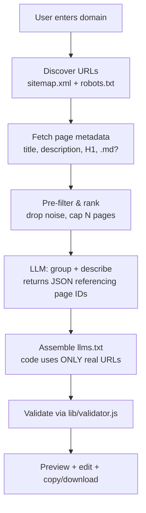

# llms.txt Generator — MVP Architecture

Status: design draft · Date: 2026-06-02

The generator turns a domain into a valid, **grounded** `llms.txt` file. The core
principle: the LLM never invents URLs. Code crawls the real site, the LLM only
*organizes and describes* the pages we actually found, and code assembles the
final file from real URLs. This is what separates us from the hallucination-prone
generators competitors ship.

---

## 1. Pipeline overview



Each stage is bounded and cancellable. Every fetch goes through `lib/ssrf.js`
(`assertPublicUrl` / `safeFetch`) — the same protection we added to the checker.

---

## 2. Stage detail

### 2.1 Discover URLs
- Fetch `/robots.txt` → read `Sitemap:` directives; respect `Disallow` for our own crawl politeness.
- Fetch `/sitemap.xml` (and sitemap indexes → child sitemaps, depth 1).
- Fallbacks when no sitemap: fetch the homepage, extract same-origin `<a href>` links (depth 1 only for MVP).
- Normalize: same registrable domain only, dedupe, strip fragments/queries, cap to **N = 100** candidate URLs for MVP.

### 2.2 Fetch metadata
- For each candidate (concurrency 6–8, via `safeFetch`, HEAD→GET, size cap):
  - Extract `<title>`, `<meta name="description">`, first `<h1>`.
  - Detect a `.md` companion (spec part 2): try `url + ".md"` with a HEAD; record if 200.
- Skip non-HTML (images, pdf) by content-type.
- Keep a compact record per page:

```ts
type Page = {
  id: string;          // stable short id, e.g. "p12"
  url: string;         // real, verified URL
  mdUrl?: string;      // verified .md companion if found
  title?: string;
  description?: string;
  h1?: string;
  depth: number;       // sitemap=0, homepage-link=1
};
```

### 2.3 Pre-filter & rank (cheap, no LLM)
- Drop obvious noise by path/title heuristics: `/tag/`, `/page/2`, `?`, login, cart, duplicate titles.
- Rank by usefulness: docs/guide/api/reference paths first, then features/products, then the rest.
- Truncate to the top **M = 40–60** pages that go to the LLM (cost control).

### 2.4 LLM: group + describe (the grounded step)
The LLM receives the page list and returns **structure only**, referencing pages by `id`.
It must not emit URLs.

LLM **input** (compact JSON): site host, optional homepage title, and the page array
(`id`, `title`, `description`, `h1`, `path`).

LLM **output** (strict JSON, validated against a schema):

```json
{
  "projectName": "FastHTML",
  "summary": "One-sentence blockquote summary grounded in real metadata.",
  "details": ["Optional short context paragraph", "..."],
  "sections": [
    { "name": "Docs", "optional": false,
      "items": [ { "pageId": "p3", "note": "Quick start guide" } ] },
    { "name": "Optional", "optional": true,
      "items": [ { "pageId": "p20", "note": "..." } ] }
  ]
}
```

Grounding guardrails (enforced in code, not trusted to the model):
- Every `pageId` must exist in our set — unknown ids are **dropped**.
- Final URLs come from `Page.url` (prefer `mdUrl` when present), never from the model.
- `summary`/`note` text is allowed to be generated, but we cap length and strip any URLs/markdown the model sneaks in.

### 2.5 Assemble (deterministic)
Code renders markdown from the validated structure → guarantees spec-correct output:
`# projectName` → `> summary` → detail paragraphs → `## Section` blocks with
`- [title](realUrl): note`. The "Optional" section is emitted last.

### 2.6 Validate + present
- Run the assembled text through `lib/validator.js` (we already have it) → show the same checks UI as the checker.
- Render Formatted Preview (reuse `renderPreview`).
- User can **edit** projectName/summary/notes inline, then **Copy** / **Download llms.txt**.
- Closed loop: generate → preview → validate → (deploy guidance) keeps the user in-product.

---

## 3. API design

One streaming endpoint so the UI shows live progress (discover → fetch → think → done):

```
POST /api/generate            # body: { domain }
  → Server-Sent Events / ReadableStream of:
     { phase: "discover", count }
     { phase: "fetch", done, total }
     { phase: "generate" }
     { phase: "result", llmsTxt, pages, validation }
     { phase: "error", message }
```

- `runtime = "nodejs"`, `export const maxDuration = <as high as plan allows>` (set explicitly; verify current Vercel limit for the plan).
- All fetches via `safeFetch`. Hard ceilings: max candidate URLs, max pages to LLM, max bytes per page, total wall-clock budget.
- If a crawl would exceed the budget, return a partial result with what we have rather than failing.

> If crawls grow beyond the function budget, move stage 2.1–2.2 to a background job
> (Vercel Queue / Upstash QStash) and have the client poll a `jobId`. Not needed for MVP.

---

## 4. Cost & abuse controls (design in from day one)

- **Rate limit** per IP (e.g. Upstash Redis ratelimit): N generations/day free.
- **Freemium split**: free = up to ~40 pages, 1–2 generations/day; paid = more pages, private (no caching), API access.
- **Caching**: cache crawl results per domain for a short TTL (e.g. 24h) so repeat/free runs are cheap. Paid users can force-refresh.
- **LLM budget guard**: one structured call per generation; hard token cap on input (that's why we pre-filter to M pages).
- **Abuse surface = the crawler**: SSRF already handled; also cap redirects, total pages, concurrency, and per-domain frequency to avoid being used to hammer third-party sites.

---

## 5. Tech choices (fits current stack)

| Concern | Choice for MVP |
|---|---|
| App | Next.js App Router (existing) |
| Crawl/parse | `safeFetch` + a lightweight HTML metadata parser (regex or `node-html-parser`); avoid heavy headless browser |
| LLM | Provider-agnostic wrapper; one structured/JSON call. Keep the key server-side only |
| Output schema | Validate model JSON (zod or hand-rolled) before assembly |
| Rate limit / cache | Upstash Redis (serverless-friendly) — optional for first cut, required before launch |
| Validation | Reuse `lib/validator.js` |
| Persistence | None required for MVP (stateless). Add KV only for cache + rate limit |

---

## 6. Build order for the generator

1. **Crawl core** (no AI): sitemap/robots discovery + metadata fetch + ranking, behind `/api/generate` returning raw pages. Verifiable on its own.
2. **Deterministic assembler + validator loop**: group pages by simple path rules (no LLM yet) → assemble → validate → preview. Already useful and shippable.
3. **Swap rule-based grouping for the LLM step** with the grounded JSON contract; keep the rule-based path as fallback when the LLM is unavailable.
4. **Editing + Copy/Download**, streaming progress UI.
5. **Rate limit + cache + freemium gating**.
6. Optional: generate `.md` companions / `llms-ctx.txt`.

Shipping after step 2 already gives a working, non-hallucinating generator (rule-based);
the LLM in step 3 mainly improves grouping quality and description wording.

---

## 7. Risks & open questions

- **Function time budget** vs. crawl size — mitigated by caps now, background queue later. Confirm the current Vercel `maxDuration` for the target plan.
- **Sites without sitemaps** — homepage-link fallback is shallow; acceptable for MVP, note it in the UI.
- **JS-rendered sites** — metadata via raw HTML may be thin; a headless render is a later, costly upgrade, not MVP.
- **Description quality** — grounded notes must stay truthful; cap length and forbid claims not present in metadata.
- **Provider lock-in** — keep the LLM call behind a thin interface so the model/provider is swappable.
